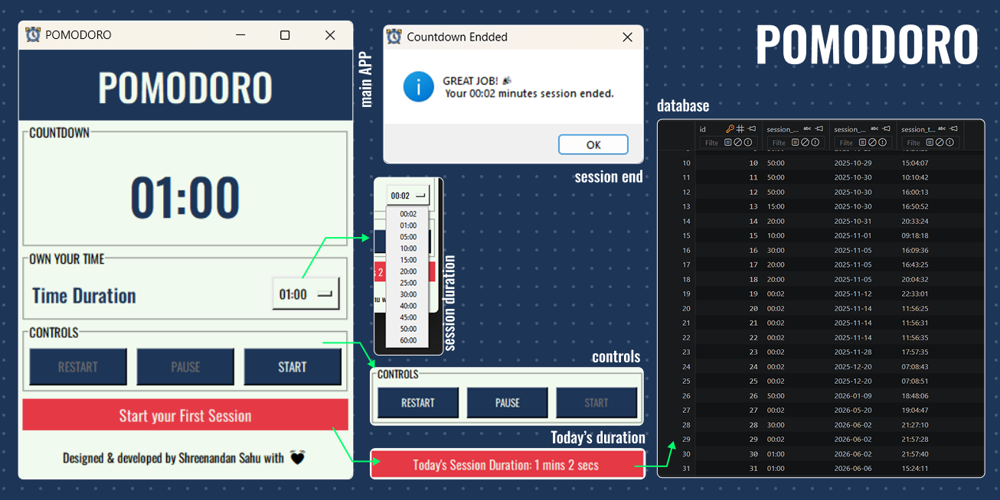

  

# **DOWNLOAD** these softwares
| POMODORO | WETHER STATION | MASTER MIND |
|:---------:|:---------:|:---------:|
| [Download] (\POMODORO.ZIP)| | |

# **POMODORO** | keep a track of your time, every second

This project aims at making a software with GUI which is a simple counter and also remembers your sessions and duration of session. This is achieved by using python, sqllite and tkinter. 

---

# **WETHER STATION** | keep a track of your environment

<!-- This project aims at making a software with GUI which is a simple counter and also remembers your sessions and duration of session. This is achieved by using python, sqllite and tkinter.  -->

---
<!--  -->

  

